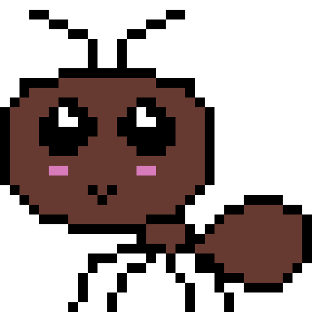

**This project was made for the Ludum Dare 53. Checkout our submission page https://ldjam.com/events/ludum-dare/53/snail-mail-2**

# Snail Mail

## Are you ready to get slimy?

The friends from the garden love to stay in touch. Thankfully, the moist mailmen are on duty. Slimy snails can effectively traverse the terrain bringing letters from and to any loved ones.


## Can you solve the traveling snailsman problem?

Traversing the garden is no easy task! The moist mailmen are disgusted by their own slime and will never consider touching their own bodily fluids. Yet, they thoroughly enjoy navigating in slime from other mailmen.


## Instructions

Snail Mail is a real-time puzzle game. Each puzzle takes place on a (mathematical) graph. You must control your snails to deliver letters to the indicated kawaii animals on time then return them all to post offices.

Be careful! It's easy to get your snails stuck as they simply refuse to slither on slime of their own color. Snails leave colored slime as they traverse paths. Coordinate your different snails to solve the puzzles (Snails can walk on paths slimed with different colors than their own)!

## The Friends

Our slippery mucus mollusks must deliver letters to The Friends. Let's introduce them:

### Lily The Ladybug
Lily is a dainty little creature. She's an old soul with a thing for flower pressing and post-modern art. She loves to flit from flower to flower in search of sweet nectar.


### Mimi The Mouse
Mimi the mouse is a curious little creature who loves to nibble on cheese and explore new places. She speaks in a quiet high pitched squeak which is lovable to most, annoying to none!


### Coco The Chick
Coco is a fluffy little ball of sunshine who a bit of a stoner and a loner. But once you get her out of her shell, she loves a good game of peek-a-boo!


### Blossom The Bee
Blossom is a hardworking little insect with the thickest thorax around. Her favourite drink are Starbucks vanilla lattés infused with flower nectar.


### Fizzy The Frog
Fizzy is a jolly little girl who loves to sing and leap through the lily pads, and she has the brightest big black eyes you've ever seen. Fizzy plays drums in an all amphibian jazz band on the weekends!


### Amber The Ant

Amber the ant may be small, but she's a hard worker; always busy carrying crumbs to the colony. Her hobbies include weightlifting, leafcutting, and nude yoga. Here's a secret she's got crush on Blossom the bee!



# Audio track (Snaily's Song) by a modern bard

The legendary lyricist @adrien-tremblay has composed a great gastropod soundtrack on his acoustic guitar for the title screen. 

Lyrics:

[verse 1] (Cmaj Emin Cmaj Emin Gmaj Fmaj Cmaj Emaj Fmaj Cmaj Emaj)

In this world of misery

His only mission is delivery

He’s got no home, only a shell to call own

Delivering mail so we don’t feel so damn alone

[chorus] G Am F C
Snail mail, he will never fail

Writing my feeling down on this here paper trail

Snail mail, solid from tentacle to tail

Delivering messages on small scale

[verse 2] (Cmaj Emin Cmaj Emin Gmaj Fmaj Cmaj Emaj Fmaj Cmaj Emaj)

Snaily don’t slither away from me

Softly leaving trails across the land and sea

His antenni twerk to the rhythm of his tail

Sliding moist and slimey as he carries your mail

[chorus] G Am F C

Snail mail, he will never fail

Writing my feeling down on this here paper trail

Snail mail, solid from tentacle to tail

This is how we deliver messages on a small scale

# Compilation

```
cd client
cmake -B build -S .
cd build
make
cd ..
```
